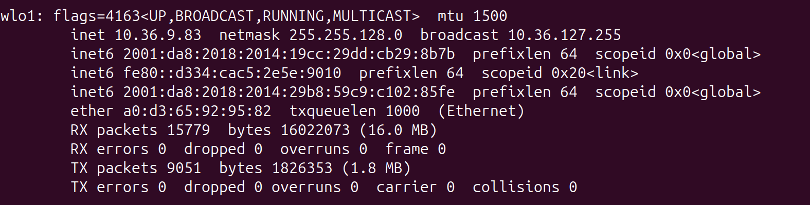

# 数据库课设--银行储蓄卡系统

总负责人：刘焯林

本项目为广东工业大学（GDUT）24级大数据专业的课程设计，采用c++和mysql实现

项目github地址: https://github.com/Aoalas/bank_system


本文为该项目的运行和解读的指导文档

具体的功能实现解读请见docs文件夹下的“银行储蓄卡管理系统项目文档.md”

## 本地运行程序

主程序的运行需要在linux系统上，本文以ubuntu24.04为例

在backend目录创建build文件夹（如果没有）

定位到build文件夹，终端输入以下指令

```
cmake ..
make
```

 

若没有报错，即输出[100%] Built target bank_server，说明构建成功,接着终端输入项目文件分布

```
./bank_system 
```

即可运行


## 网页加载

本项目使用局域网连接，以gdut WIFI为例


在windows系统，连接gdut后，终端输入**ipconfig**，即可查看当前gdut的地址信息

在linux系统，连接gdut后，终端输入**ifconfig**，即可查看当前gdut的地址信息，如下（信息可能会变，以具体结果为准）：




如图，作者此时查询到的地址为10.36.9.83（地址不定，需要读者自己查阅）

本程序在端口18080运行，即在地址后加上端口即可访问，如在浏览器上直接访问10.36.9.83:18080，注意gdut WIFI要保持连接

（当然WIFI可以变化，只要所有访问者都在同一个局域网下都可以实现该项目的页面访问）


如上，页面成功加载，可以正常使用

若网页显示无法访问，检查以下问题：

1.请确定WIFI是否为gdut（访问者与服务器是否位于同一局域网下）

2.网页端的地址是否与终端查询地址的结果一致，输入的端口是否为18080

3.检查执行./bank_system的终端的程序是否正常运行


关于该项目的更多信息，可见docs目录下的**银行储蓄卡管理系统项目文档.md**


## 项目文件分布

**bank_system/**

- README.md (文档)
- **backend/** (后端代码与构建目录)
  - **CMakeLists.txt**
  - **build/** (编译输出目录)
  - **cmake-build-debug/** (调试构建目录)
  - **include/**
    - **DatabaseManager.h**
    - **crow_all.h**
  - **src/**
    - **DatabaseManager.cpp**
    - **main.cpp**
- **database/** (数据库初始化指令记录)
  - **init_database_sql.txt**
- **docs/** (文档资料)
  - **银行储蓄卡管理系统项目文档.md**
  - **picture/** (文档图片)
- **frontend/** (前端资源)
  - **css/**
    - **style.css**
  - **html/**
    - **dashboard.html**
    - **login.html**
    - **profile.html**
    - **register.html**
    - **test.html**
  - **js/**
    - **dashboard.js**
    - **profile.js**
    - **register.js**

