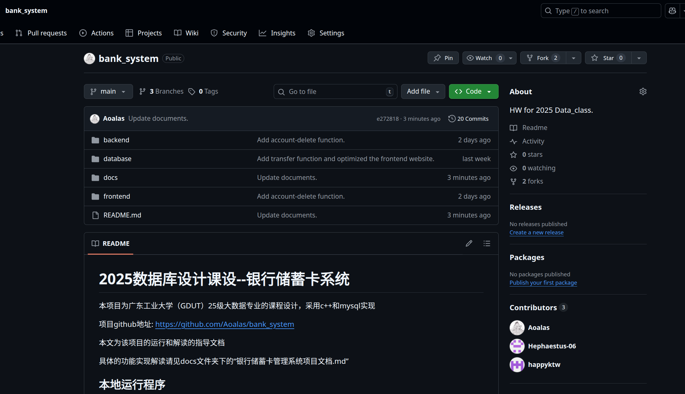
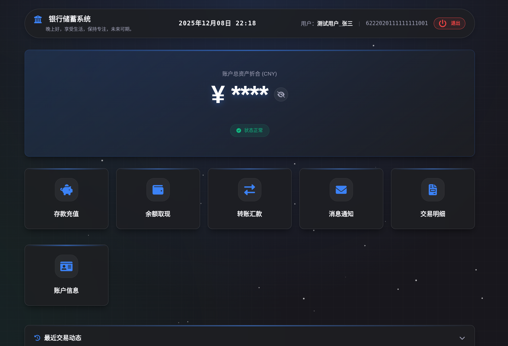
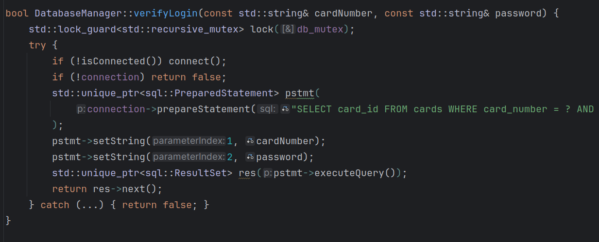
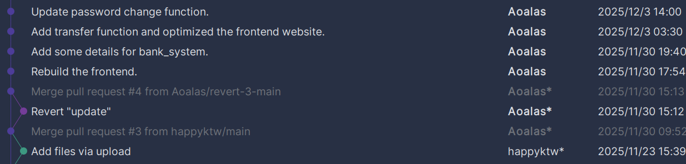

# 银行储蓄卡管理系统项目文档

组长：刘焯林

组员：阮智信，吴金翔

该项目以上传至github，URL:https://github.com/Aoalas/bank_system

项目的github网页如下，三位contributors对应该项目的三位成员

## 1. 项目概述

本项目是一个基于 C++ (Crow 框架) 后端与 HTML/CSS/JS 前端的全栈银行储蓄模拟系统。项目实现了用户开户、登录、存取款、转账、信息管理及注销账户等功能。

数据库的运行平台为ubuntu24.04，使用局域网连接（IP为服务器的局域网地址，端口号为18080，本项目以gdut WIFI为例）

## 2. 基础功能实现说明

本项目已完整实现以下要求：

### 2.1 用户账户管理

- **开户** ：
  - 实现了新用户注册流程，要求输入真实姓名、身份证号、手机号及初始存款。
  - 逻辑校验：后端会自动检查身份证号和手机号是否已被占用，防止重复开户。
- **登录**：
  - 使用储蓄卡号和密码进行身份验证。
  - 登录成功后跳转至用户主页。
- **个人档案**：
  - 用户可以查看详细的身份信息（姓名、身份证、预留手机号）。
  - 支持信息修改，允许用户更新联系方式等非关键信息。
  - 支持密码修改，需验证旧密码以确保安全。

### 2.2 资金存取

- **存款**：
  - 用户可输入任意金额进行存款，后端实时更新数据库余额并记录交易流水。
- **取款**：
  - 实现了余额检查机制，若账户余额不足，系统将拒绝取款请求并提示用户。

### 2.3 账户注销

- **安全流程**：
  - 在注销前，系统强制要求用户输入卡号、姓名、电话进行**二次身份核验**。
  - **余额检测**：系统会自动检测账户余额，若有剩余资金，会弹出红色警告提示用户先清空资金。
  - **防误触机制**：确认按钮设有 5 秒倒计时，倒计时结束后方可点击“确定注销”，彻底从数据库中清除用户数据。

### 2.4 信息查询

- **余额查询**：主页实时显示当前账户余额，并提供“眼睛”按钮用于切换 **显示/隐藏** 隐私模式。
- **交易明细**：
  - 主页展示最近 5 条交易动态。
  - 提供完整的交易历史查询功能，记录每一笔资金的流向、时间和类型。

以下为登录用户主页：

------

## 3. 额外功能内容解释

除了基础作业要求外，本项目还实现了以下进阶功能：

### 3.1 转账系统

这是本项目最核心的扩展功能，实现了用户间的资金流转。

- **实名校验**：在输入目标卡号后，系统会自动查询并显示收款人姓名，防止用户转错账。

- **事务一致性** ：
  
  - 后端采用了数据库事务处理机制。
  - 转账过程被视为一个原子操作。
  - 如果过程中任何一步失败，系统会自动回滚，保证资金绝对安全，不会出现钱扣了但没到账的情况。
  
- **消息通知**：转账成功后，收款方会收到一条系统消息，提示收到转账及附带的留言。

  

### 3.2 SQL 注入防御

为了保障数据安全，本项目在数据库交互层做了严格的防护：

- **原理**：并没有使用简单的字符串拼接来构建 SQL 语句（例如 `SELECT * FROM users WHERE name = '` + input + `'`），因为这种方式容易被黑客利用（输入 `' OR '1'='1` 绕过登录）。

- **实现**：使用了 `mysql_driver` 提供的预处理语句。
  - 代码中使用 `?` 作为占位符（例如 `SELECT * FROM cards WHERE card_number = ?`）。
  
  - 用户输入的数据被当作纯粹的“参数”传递给数据库，而不是作为 SQL 命令的一部分执行。
  
  - 这意味着即使用户输入恶意的 SQL 代码，数据库也只会将其视为一串普通的文本，从而彻底杜绝了 SQL 注入攻击。
  
    
  
    如下图所示，调用 setString 时，用户输入的内容会被严格视为纯文本字符串。如果在卡号框输入 ' OR 1=1 --，数据库会去查找一个卡号恰好叫 ' OR 1=1 -- 的用户，所以SQL攻击失效。
  
    
  
    

### 3.3 UI 设计

- **动态交互**：
  - 所有弹窗均带有平滑的进出场动画（淡入淡出、缩放）。
  - 主页集成了动态星空背景和实时系统时间显示。
  
- **消息提醒**：实现了带有红点提示的消息中心，点击消息后红点即时消失。

  

------

## 4. 技术栈

- **后端**：C++（使用了MySQL Connector/C++ 库）
- **前端**：HTML, CSS,  JS
- **数据库**：MySQL

该项目的推进中，使用git工具和github来进行项目管理，支持每次代码提交的进行，并方便进行差异比较，进行功能增减的解读，同时可以实现项目代码的回溯，避免损坏项目，而且提交代码的信息和日期将进度清晰可视化，便于成员之间不同功能实现于改进的配合。

该项目的部分commit记录如下:

## 5. 备注

​	GDUT 24级数据科学与大数据技术，数据库课程设计项目--**银行储蓄卡管理系统**

​	关于该项目的其他信息可见项目首目录的README.md